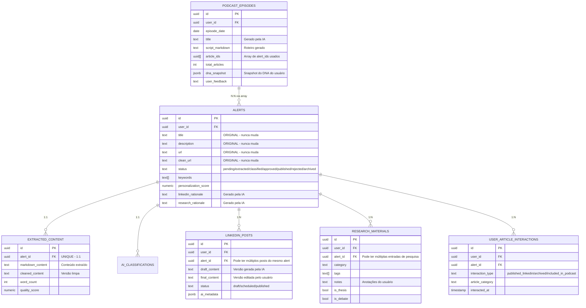

# Arquitetura de Dados - Meupainel

## Análise da Arquitetura Atual de Reuso de Alertas

### ✅ **Resposta Direta: A arquitetura ESTÁ CORRETA para reuso**

A tabela `alerts` funciona como **fonte única de verdade (Single Source of Truth)** e os dados originais **permanecem intactos**. Cada funcionalidade cria sua própria tabela derivada referenciando o `alert_id`.

---

## 📊 Modelo de Dados Atual



---

## 🔍 Como Funciona o Reuso de Dados

### 1️⃣ **Fluxo de Entrada (Dados Originais)**

```
Gmail/RSS → alerts (IMUTÁVEL)
              ↓
         extracted_content (conteúdo completo extraído)
              ↓
         ai_classifications (categoria, confiança)
```

**Garantia de Imutabilidade:**
- As colunas `title`, `description`, `url`, `clean_url` na tabela `alerts` **nunca são modificadas**
- Apenas o campo `status` muda conforme o pipeline
- Campos `linkedin_rationale` e `research_rationale` são **adicionados**, não substituem dados originais

---

### 2️⃣ **Podcast: Referência por Array de IDs**

**Estrutura:**
```typescript
podcast_episodes {
  article_ids: UUID[]  // [alert_id_1, alert_id_2, ...]
  script_markdown: string  // Roteiro GERADO, não modifica alerts
  dna_snapshot: JSONB  // Snapshot do DNA no momento da geração
}
```

**Como funciona:**
1. Edge Function `generate-personalized-podcast` busca alertas via `get_personalized_articles_for_podcast()`
2. Função SQL retorna **cópia dos dados** (não referência direta):
   ```sql
   SELECT 
     a.id as alert_id,
     a.title,  -- CÓPIA do título original
     a.publisher,
     ec.cleaned_content as content  -- CÓPIA do conteúdo
   FROM alerts a
   INNER JOIN extracted_content ec ON ec.alert_id = a.id
   ```
3. IA gera roteiro baseado nas **cópias**
4. Roteiro é salvo em `podcast_episodes.script_markdown`
5. IDs dos alertas usados são salvos em `article_ids` array

**✅ Dados originais permanecem intactos**

---

### 3️⃣ **LinkedIn: Tabela Derivada com Versionamento**

**Estrutura:**
```typescript
linkedin_posts {
  alert_id: UUID  // Referência ao alert original
  draft_content: string  // Versão gerada pela IA
  final_content: string  // Versão editada pelo usuário
  status: 'draft' | 'scheduled' | 'published'
}
```

**Como funciona:**
1. Edge Function `generate-linkedin-post` lê dados do alert:
   ```typescript
   const { data: alert } = await supabase
     .from("alerts")
     .select("id, title, description, clean_url")
     .eq("id", alert_id)
     .single();
   ```
2. IA gera post baseado nos dados originais
3. Post é salvo em **nova linha** na tabela `linkedin_posts`
4. Usuário pode editar `final_content` sem afetar `draft_content`
5. Múltiplos posts podem ser gerados do **mesmo alert**

**✅ Permite múltiplas versões sem modificar o original**

---

### 4️⃣ **Research: Múltiplas Entradas por Alert**

**Estrutura:**
```typescript
research_materials {
  alert_id: UUID  // Referência ao alert
  category: string  // Categoria de pesquisa
  tags: string[]  // Tags customizadas
  notes: string  // Anotações do usuário
  is_thesis: boolean
  is_debate: boolean
}
```

**Como funciona:**
1. Usuário pode adicionar o mesmo alert em **múltiplas categorias** de pesquisa
2. Cada entrada tem suas próprias `notes` e `tags`
3. Alert original permanece inalterado

**✅ Flexibilidade total sem modificar fonte**

---

## 🎯 Validação da Arquitetura

### ✅ **Pontos Fortes**

| Aspecto               | Status    | Explicação                                                       |
| --------------------- | --------- | ---------------------------------------------------------------- |
| **Imutabilidade**     | ✅ Correto | Dados originais em `alerts` nunca mudam                          |
| **Reuso**             | ✅ Correto | Mesmo alert pode ser usado em podcast, LinkedIn, pesquisa        |
| **Rastreabilidade**   | ✅ Correto | `alert_id` permite rastrear origem de qualquer conteúdo derivado |
| **Versionamento**     | ✅ Correto | LinkedIn permite `draft_content` vs `final_content`              |
| **Múltiplos Usos**    | ✅ Correto | Um alert pode gerar N posts no LinkedIn, N entradas de pesquisa  |
| **Snapshot Temporal** | ✅ Correto | Podcast salva `dna_snapshot` para auditoria                      |

---

### ⚠️ **Pontos de Atenção**

#### 1. **Podcast usa Array de IDs (não Foreign Key)**

**Situação Atual:**
```sql
podcast_episodes {
  article_ids UUID[]  -- Array simples
}
```

**Problema Potencial:**
- Se um alert for deletado, o array continua com ID órfão
- Não há constraint de integridade referencial

**Solução Recomendada:**
Criar tabela de junção:
```sql
CREATE TABLE podcast_episode_articles (
  id UUID PRIMARY KEY DEFAULT gen_random_uuid(),
  episode_id UUID REFERENCES podcast_episodes(id) ON DELETE CASCADE,
  alert_id UUID REFERENCES alerts(id) ON DELETE CASCADE,
  position INT,  -- Ordem no roteiro
  UNIQUE(episode_id, alert_id)
);
```

**Benefícios:**
- Integridade referencial garantida
- Permite rastrear quais podcasts usaram cada alert
- Facilita queries reversas: "quais podcasts usaram este alert?"

---

#### 2. **Falta de Auditoria de Modificações**

**Situação Atual:**
- Não há histórico de quando `linkedin_rationale` ou `research_rationale` foram adicionados
- Não sabemos qual versão da IA gerou cada conteúdo

**Solução Recomendada:**
Adicionar campos de auditoria:
```sql
ALTER TABLE alerts
ADD COLUMN linkedin_rationale_generated_at TIMESTAMPTZ,
ADD COLUMN linkedin_rationale_version TEXT,
ADD COLUMN research_rationale_generated_at TIMESTAMPTZ;
```

---

#### 3. **Podcast Não Salva Conteúdo Original Usado**

**Situação Atual:**
- `podcast_episodes.script_markdown` contém roteiro gerado
- Não sabemos exatamente qual versão do conteúdo foi usada (se foi `cleaned_content` ou `markdown_content`)

**Solução Recomendada:**
Adicionar campo de metadados:
```sql
ALTER TABLE podcast_episodes
ADD COLUMN source_metadata JSONB;

-- Exemplo de conteúdo:
{
  "articles_used": [
    {
      "alert_id": "uuid",
      "title_snapshot": "título no momento da geração",
      "content_type": "cleaned_content",
      "word_count": 1500
    }
  ]
}
```

---

## 📋 Exemplo Prático de Reuso

### Cenário: Um Alert Usado em 3 Contextos

```sql
-- 1. Alert Original (IMUTÁVEL)
INSERT INTO alerts (id, title, description, url, status)
VALUES (
  '123e4567-e89b-12d3-a456-426614174000',
  'Google lança Gemini 2.0',
  'Nova versão do modelo de IA...',
  'https://blog.google/technology/ai/google-gemini-ai-update-december-2024/',
  'classified'
);

-- 2. Conteúdo Extraído (1:1)
INSERT INTO extracted_content (alert_id, cleaned_content, word_count)
VALUES (
  '123e4567-e89b-12d3-a456-426614174000',
  'Texto completo do artigo...',
  2500
);

-- 3. Usado no Podcast (Referência via Array)
INSERT INTO podcast_episodes (user_id, article_ids, script_markdown)
VALUES (
  'user-uuid',
  ARRAY['123e4567-e89b-12d3-a456-426614174000'],
  '# Podcast do Dia\n\nHoje vamos falar sobre o Gemini 2.0...'
);

-- 4. Gerado Post no LinkedIn (Tabela Derivada)
INSERT INTO linkedin_posts (user_id, alert_id, draft_content, status)
VALUES (
  'user-uuid',
  '123e4567-e89b-12d3-a456-426614174000',
  '🚀 Google acaba de lançar o Gemini 2.0!\n\nEssa atualização traz...',
  'draft'
);

-- 5. Adicionado à Pesquisa (Múltiplas Entradas)
INSERT INTO research_materials (user_id, alert_id, category, tags, notes)
VALUES (
  'user-uuid',
  '123e4567-e89b-12d3-a456-426614174000',
  'IA Generativa',
  ARRAY['gemini', 'google', 'llm'],
  'Comparar com GPT-4 Turbo'
);
```

**Resultado:**
- ✅ Alert original permanece inalterado
- ✅ Podcast tem roteiro próprio
- ✅ LinkedIn tem post customizado
- ✅ Pesquisa tem anotações próprias
- ✅ Todos referenciam o mesmo `alert_id`

---

## 🔧 Recomendações de Melhoria

### Prioridade Alta

1. **Habilitar RLS em `podcast_episodes`** (já identificado)
2. **Criar tabela de junção `podcast_episode_articles`** para integridade referencial

### Prioridade Média

3. **Adicionar campos de auditoria** para rastrear quando rationales foram gerados
4. **Adicionar `source_metadata` em podcast_episodes** para snapshot do conteúdo usado

### Prioridade Baixa

5. **Criar view materializada** para facilitar queries de "quais alertas foram usados em quais contextos"

---

## ✅ Conclusão

**A arquitetura atual ESTÁ CORRETA** para o reuso de alertas:

1. ✅ **Dados originais permanecem intactos** na tabela `alerts`
2. ✅ **Cada funcionalidade tem sua própria tabela derivada**
3. ✅ **`alert_id` garante rastreabilidade**
4. ✅ **Permite múltiplos usos do mesmo alerta** (N posts LinkedIn, N entradas de pesquisa, etc.)
5. ✅ **Versionamento** permite comparar draft vs final no LinkedIn

**Único ajuste necessário:**
- Substituir `article_ids UUID[]` por tabela de junção para garantir integridade referencial
- Adicionar RLS em `podcast_episodes` (já identificado na análise anterior)

A arquitetura segue o padrão **Event Sourcing Light**, onde `alerts` é a fonte de verdade e as outras tabelas são **projeções/materializações** para casos de uso específicos.
